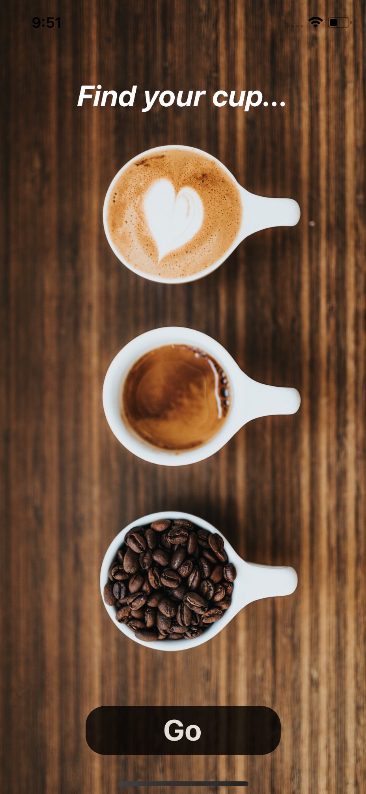
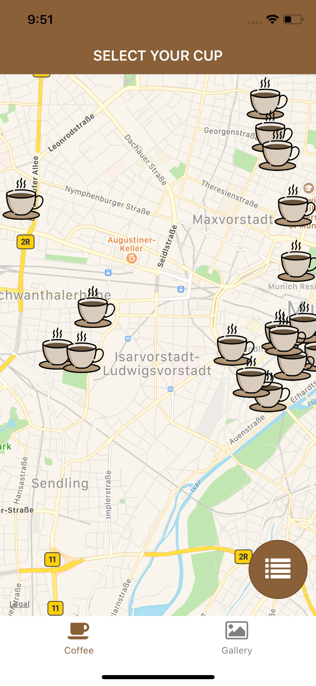
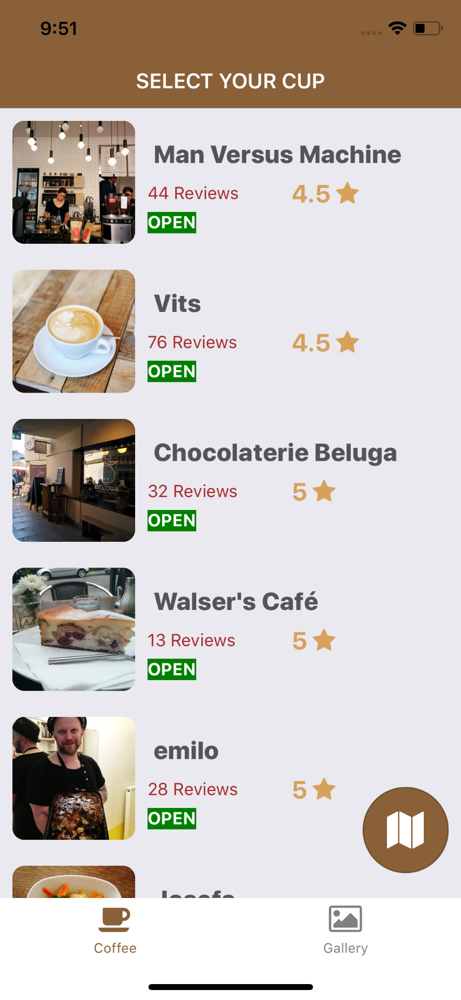
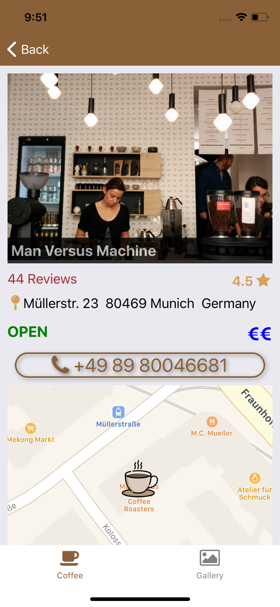
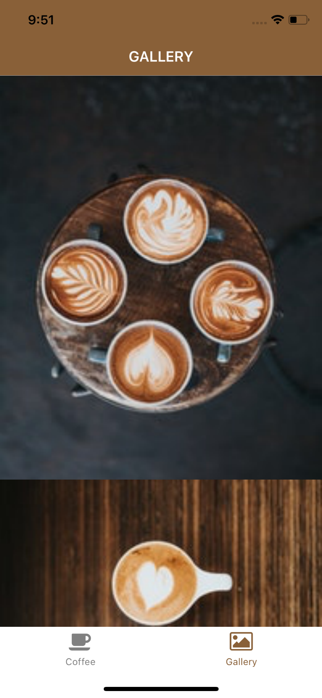

## App for coffee lovers. Demonstrates all the basic concepts of React Native

### The app demonstrates the use of following:-
1) React Native
2) Redux
3) Redux Saga
4) Native iOS bridge
5) React Native Apps
6) Stack and Tab Navigation

### Few Screenshots are below

### To Do
1) Animation API implementation
2) Unit test cases
